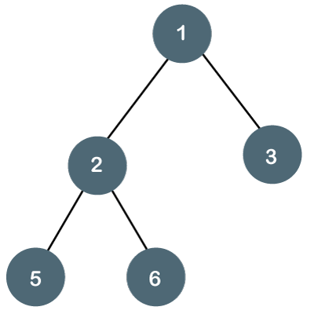

# Two Sub Tree

題目敘述：

給定一顆二元樹，編號從根節點由上往下由左至右為0, 1, 2, 3, 4

找出該樹的兩子樹之間最小差diff



Example : 

parent = [-1, 0, 0, 1, 1]

files_size = [1, 2, 3, 5, 6]

思路：

先將整顆樹權重加總

建立unordered_map建表紀錄每個node的child

接著dfs整棵樹，從leaf node開始往回走，如果這棵樹以該節點之下的子樹，與整棵樹的另外一顆子樹相差為最小，則更新minDiff

> 主要是想遍歷整個 tree，假設是一般樹狀結構就是發現 nullptr 直接 return
> 

> 但根據 parent 來建表，因此同這句敘述的內容，由於查表找不到 child node，不會做 for 迴圈裡的操作，最後 return sum = 0
> 

ANS : abs(abs((1 + 2 + 3 + 5)) - (6)) = 5

```cpp
#include <iostream>
#include <cstdlib>
#include <vector>
#include <unordered_map>
#include <algorithm>
#include <numeric>

using namespace std;
int treeSum = 0;
int minDiff = INT_MAX;
int dfs(int root, vector<int>& file_size, unordered_map<int, vector<int>> childs) {
	int sum = 0;
	for(int child : childs[root]) {
		int subSum = dfs(child, file_size, childs);
		sum += subSum;
		minDiff = min(minDiff, abs(abs(treeSum - subSum) - subSum));
	}
	sum += file_size[root];
	return sum;

}

void helper(vector<int> parent, vector<int> file_size) {
	/*
    for(int i = 0; i < file_size.size(); i++) {
		treeSum += file_size[i];
	}*/
	treeSum = accumulate(file_size.begin(), file_size.end(), 0);
	unordered_map<int, vector<int>> childs;
	for(int i = 0; i < parent.size(); i++) {
		childs[parent[i]].emplace_back(i);
	}
	/* 
	  [-1, 0]
	  [0, 1]
	  [0, 2]
	  [1, 3]
	  [1, 4]
	*/
	
	dfs(0, file_size, childs);
}

int main(int argc, char const *argv[])
{
	vector<int> parent = {-1, 0, 0, 1, 1};
	vector<int> file_size = {1, 2, 3, 4, 5};
	helper(parent, file_size);
	cout << "minDiff = " << minDiff << "\n";

	return 0;
}
```

延伸問題：

> 其實算是 adjacency list (甚至應該可以只用 2D vector 而不是 unordered_map)
> 

> adjacency list 在 graph 問題蠻常用到，可以參考 leetcode 類似題型的做法
> 

> 如果這個 2d vector 是 adjacency matrix，就會浪費記憶體空間
> 

> amortized time 下來的複雜度兩者一樣
> 

> 在 leetcode 開過 unordered_map 的 adjacency list，曾經在常數時間複雜度爛掉過
> 

> unordered_map 操作的複雜度，群暉面試
>